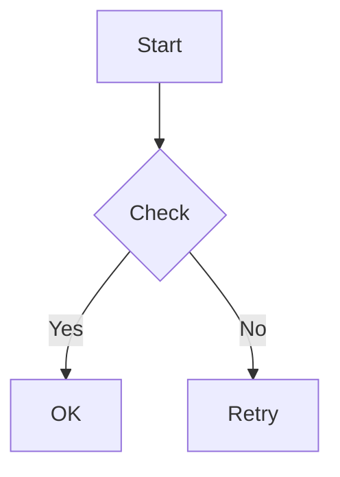
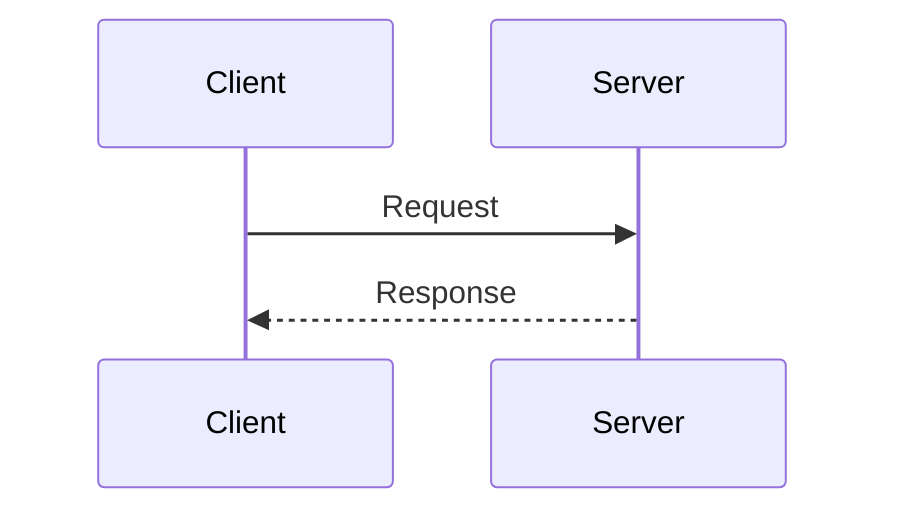
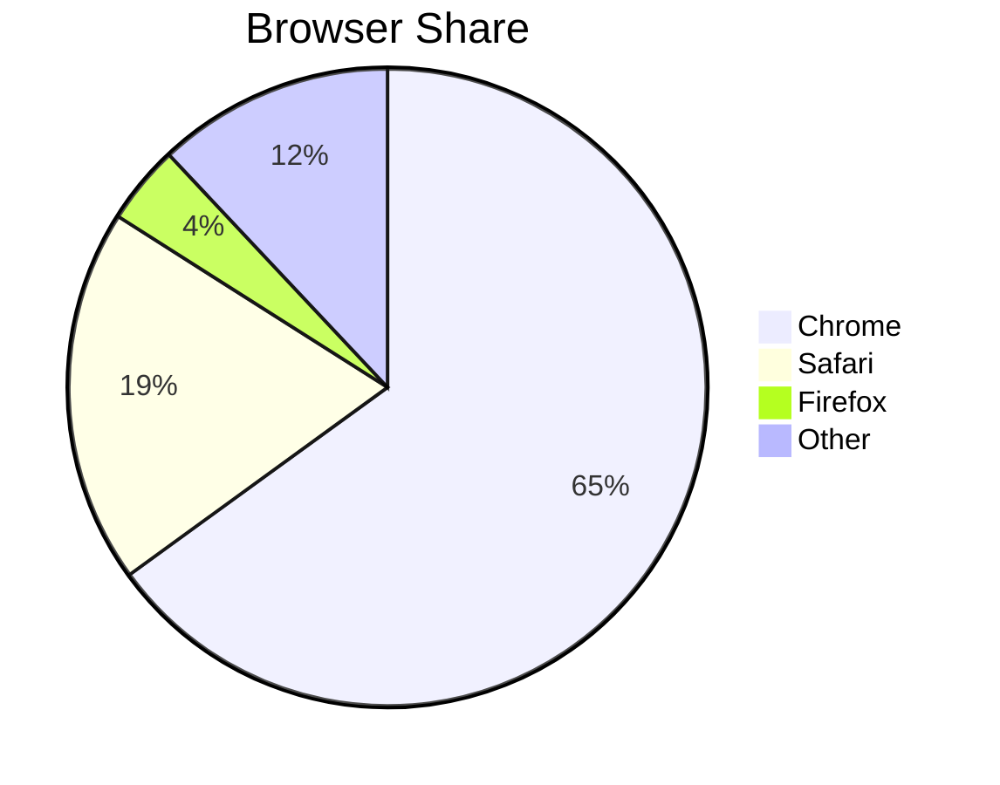
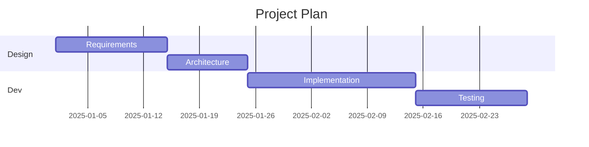
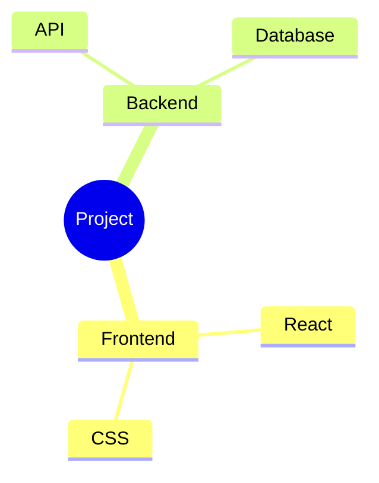

# ligarb - Generate a single-page HTML book from Markdown files

Version: {{VERSION}}

## Overview

ligarb converts multiple Markdown files into a self-contained index.html.
The generated HTML includes:
- A left sidebar with a searchable table of contents (h1-h3)
- Chapter-based content switching in the main area
- Permalink support via URL hash (#chapter-slug)
- Responsive design with print-friendly styles
- Syntax-highlighted code blocks
- Search with content highlighting
- Chapter and section numbering (configurable)
- Previous/Next chapter navigation
- Dark mode toggle (saved to localStorage)
- Custom CSS support
- "Edit on GitHub" links (optional)
- Footnotes (kramdown syntax)

## Commands

### `ligarb init [DIRECTORY]`

Create a new book project with scaffolding.
If DIRECTORY is given, creates and populates that directory.
If omitted, populates the current directory.
Generates book.yml, 01-introduction.md, and images/.
If .md files already exist, registers them as chapters.
Aborts if book.yml already exists.

### `ligarb build [CONFIG]`

Build the HTML book.
CONFIG defaults to 'book.yml' in the current directory.

### `ligarb serve [CONFIG...]`

Start a local web server with live reload and review UI.
CONFIG defaults to 'book.yml' in the current directory.
Multiple CONFIG paths can be given to serve multiple books.

Options:
- `--port PORT` — Server port (default: 3000)
- `--multi` — Force multi-book mode (even with 1 CONFIG)

**Single book mode** (1 CONFIG, without --multi):
- Serves the built HTML book at http://localhost:PORT

**Multi-book mode** (2+ CONFIGs, or --multi):
- Top page (/) shows a book index with links
- Each book is served at /\<directory-name\>/
- "Write a new book" button on the index page to generate
  a new book via AI (posts a brief, runs Writer in background)
- Example: `ligarb serve */book.yml`

Features:
- Injects a reload button that pulses when build output changes
- Injects a review UI for commenting on book text
- Review comments are saved to .ligarb/reviews/\*.json
  (in each book's directory)
- If 'claude' CLI is installed, comments are sent to Claude
  for review suggestions, and approved changes are applied
  to the source Markdown files and the book is rebuilt
- Review patches can span multiple chapters and the
  bibliography file (Claude reads book.yml to find all files)

### `ligarb librarium`

Start a multi-book library server.
Automatically discovers \*/book.yml in the current directory.
Equivalent to: `ligarb serve --multi */book.yml`

Options:
- `--port PORT` — Server port (default: 3000)

### `ligarb help`

Show this detailed specification.

### `ligarb --help`

Show short usage summary.

### `ligarb version`

Show the version number.

## Configuration: book.yml

The configuration file is a YAML file with the following fields:

| Field | Required | Default | Description |
|-------|----------|---------|-------------|
| `title` | required | — | The book title displayed in the header and \<title\> tag. |
| `author` | optional | empty | Author name displayed in the header. |
| `language` | optional | `"en"` | HTML lang attribute value. |
| `output_dir` | optional | `"build"` | Output directory relative to book.yml. |
| `chapter_numbers` | optional | `true` | Show chapter/section numbers (e.g. "1.", "1.1", "1.1.1"). |
| `style` | optional | — | Path to a custom CSS file relative to book.yml. Loaded after the default styles, so it can override any rule. |
| `repository` | optional | — | GitHub repository URL (e.g. "https://github.com/user/repo"). When set, each chapter shows a "View on GitHub" link. The link points to `{repository}/blob/HEAD/{path-from-git-root}`. The chapter path is resolved relative to the Git repository root. |
| `ai_generated` | optional | `false` | Mark the book as AI-generated content. When true: adds an "AI Generated" badge in the sidebar header, adds a default disclaimer footer to each chapter, and adds noindex/noai meta tags to prevent search indexing and AI training. The footer text can be overridden with the 'footer' field. |
| `footer` | optional | — | Custom text displayed at the bottom of each chapter. Overrides the default ai_generated disclaimer if both are set. Useful for copyright notices, disclaimers, or other per-chapter text. |
| `translations` | optional | — | A mapping of language codes to config file paths. Enables multi-language support. See "Translations" section below. |
| `chapters` | required | — | Book structure. An array that can contain: a cover, chapter strings, parts, and appendix. |

### chapters array

The chapters array supports four element types:

**1. Cover** (object with 'cover' key):

```yaml
chapters:
  - cover: cover.md          # Markdown file: landing page shown when the book is opened
                              # Not shown in the TOC sidebar.
```

**2. Plain chapter** (string):

```yaml
chapters:
  - 01-introduction.md
```

**3. Part** (object with 'part' and 'chapters' keys):

```yaml
chapters:
  - part: part1.md           # Markdown file: h1 = part title, body = opening text
    chapters:
      - 01-introduction.md
      - 02-getting-started.md
```

**4. Appendix** (object with 'appendix' key, value is array of chapter files):

```yaml
chapters:
  - appendix:
    - a1-references.md
    - a2-glossary.md
```

These can be combined freely:

```yaml
chapters:
  - cover: cover.md
  - part: part1.md
    chapters:
      - 01-introduction.md
      - 02-getting-started.md
  - part: part2.md
    chapters:
      - 03-advanced.md
  - appendix:
    - a1-references.md
```

Part numbering is sequential across parts (1, 2, 3, ...).
Appendix numbering uses letters (A, B, C, ...).

### Example book.yml (simple)

```yaml
title: "My Software Guide"
author: "Author Name"
language: "ja"
chapters:
  - 01-introduction.md
  - 02-getting-started.md
  - 03-advanced.md
```

### Example book.yml (with parts and appendix)

```yaml
title: "My Software Guide"
author: "Author Name"
language: "ja"
chapters:
  - part: part1.md
    chapters:
      - 01-introduction.md
      - 02-getting-started.md
  - part: part2.md
    chapters:
      - 03-advanced.md
      - 04-deployment.md
  - appendix:
    - a1-config-reference.md
```

## Directory Structure

A typical book project has this structure:

```
my-book/
├── book.yml              # Configuration file
├── part1.md              # Part opening page (optional)
├── 01-introduction.md    # Markdown source files
├── 02-getting-started.md
├── 03-advanced.md
└── images/               # Image files (optional)
    ├── screenshot.png
    └── diagram.svg
```

After running `ligarb build`, the output is:

```
my-book/
└── build/
    ├── index.html        # Single-page HTML book
    ├── js/               # Auto-downloaded (only if needed)
    ├── css/              # Auto-downloaded (only if needed)
    └── images/           # Copied image files
```

## Markdown Files

Each Markdown file represents one chapter. ligarb uses GitHub Flavored
Markdown (GFM) via kramdown. Supported syntax includes:

- Headings (# h1, ## h2, ### h3) — used for TOC generation
- Code blocks with language-specific syntax highlighting (\`\`\` fenced blocks)
- Tables, task lists, strikethrough, and other GFM extensions
- Inline HTML

The first heading (h1) in each file becomes the chapter title in the TOC.

## Fenced Code Blocks

The following fenced code block types are automatically detected and
rendered. Required JS/CSS is auto-downloaded on first build to build/js/
and build/css/.

| Block type | Description |
|-----------|-------------|
| `` ```ruby ``, `` ```python ``, etc. | Syntax highlighting (highlight.js, BSD-3-Clause) |
| `` ```mermaid `` | Diagrams: flowcharts, sequence, bar/line/pie charts, gantt, mindmap, etc. (mermaid, MIT) |
| `` ```math `` | LaTeX math equations (KaTeX, MIT) |
| `` ```functionplot `` | Function graphs (function-plot + d3, MIT) |

These are rendered visually in the output HTML — use them freely.

### Mermaid examples

Flowchart:

````markdown

````

Sequence diagram:

````markdown

````

Bar chart:

````markdown

````

Line chart (line only):

````markdown
```mermaid
xychart
    title "Temperature"
    x-axis ["Jan", "Feb", "Mar", "Apr", "May", "Jun"]
    y-axis "°C" -5 --> 30
    line [2, 4, 10, 16, 22, 26]
```
````

Pie chart:

````markdown

````

Gantt chart:

````markdown

````

Mindmap:

````markdown

````

### Math (KaTeX, LaTeX syntax)

````markdown
```math
E = mc^2
```
````

Inline math uses `$...$` syntax within text:

```
The equation $E = mc^2$ is well-known.
```

Rules for inline math:
- `$$` is not matched (use `` ```math `` for display math)
- `$` followed by a space is not matched (e.g. $10)
- `$` preceded by a space is not matched
- Content inside `<code>` and `<pre>` is not affected
- The content is rendered with KaTeX (displayMode: false)

### Function plot

````markdown
```functionplot
y = sin(x)
y = x^2 - 1
range: [-2pi, 2pi]
yrange: [-3, 3]
```
````

Function plot syntax:
- `y = <expr>` — Standard function (e.g. `y = sin(x)`)
- `r = <expr>` — Polar function (e.g. `r = cos(2*theta)`)
- `parametric: <x>, <y>` — Parametric curve (e.g. `parametric: cos(t), sin(t)`)
- Bare expression — Treated as `y = <expr>`

Options (one per line):
- `range` / `xrange: [min, max]` — X-axis range (supports pi, e.g. `[-2pi, 2pi]`)
- `yrange: [min, max]` — Y-axis range
- `width: <pixels>` — Plot width (default: 600)
- `height: <pixels>` — Plot height (default: 400)
- `title: <text>` — Plot title
- `grid: true` — Show grid lines

## Images

Place image files in the `images/` directory next to book.yml.
Reference them from Markdown with relative paths:

```markdown

```

ligarb rewrites image paths to `images/filename` in the output and copies
all files from the images/ directory to the output.

## Build

Run from the directory containing book.yml:

```
ligarb build
```

Or specify a path to book.yml:

```
ligarb build path/to/book.yml
```

The generated index.html is a fully self-contained HTML file (CSS and JS
are embedded). Open it directly in a browser — no web server needed.

## Footnotes

Footnotes use kramdown syntax:

```markdown
This is a sentence with a footnote[^1].

[^1]: This is the footnote content.
```

Footnote IDs are scoped per chapter to avoid collisions in the single-page
output.

## Index

Mark terms for the book index using Markdown link syntax with `#index`:

```markdown
[Ruby](#index)                           Index the link text as-is
[dynamic typing](#index:動的型付け)       Index under a specific term
[Ruby](#index:Ruby,Languages/Ruby)       Multiple index entries (comma-separated)
[Ruby](#index:Languages/Ruby)            Hierarchical: Languages > Ruby
```

The link is rendered as plain text in the output (no link styling).
An "Index" section is automatically appended at the end of the book,
with terms sorted alphabetically and grouped by first character.

Clicking an index entry navigates to the exact location in the chapter.

## Bibliography

Cite references in the text using Markdown link syntax with `#cite`:

```markdown
[Ruby](#cite:matz1995)       Cite by key; rendered as Ruby[Matsumoto, 1995]
```

Define a bibliography data file in book.yml:

```yaml
bibliography: references.yml   # YAML format
bibliography: references.bib   # BibTeX format
```

The format is auto-detected by file extension (.bib = BibTeX, otherwise YAML).

### YAML format

Maps keys to reference data:

```yaml
matz1995:
  author: "Yukihiro Matsumoto"
  title: "The Ruby Programming Language"
  year: 1995
  url: "https://www.ruby-lang.org"
  publisher: "O'Reilly"
  doi: "10.1234/example"
```

### BibTeX format

```bibtex
@book{matz1995,
  author = {Yukihiro Matsumoto},
  title = {The Ruby Programming Language},
  year = {1995},
  publisher = {O'Reilly},
  url = {https://www.ruby-lang.org}
}
```

BibTeX notes:
- Entry types (@book, @article, etc.) are preserved for formatting
- Field values can use {braces} or "quotes"
- Nested braces are supported one level deep (`{The {Ruby} Language}`)
- Lines starting with `%` are comments

### Supported fields

author, title, year, url, publisher, journal, booktitle, volume,
number, pages, edition, doi, editor, note.

### Formatting by type

| Type | Format |
|------|--------|
| book | Author. *Title*. Edition. Publisher, Year. |
| article | Author. "Title". Journal, Volume(Number), Pages, Year. |
| inproceedings | Author. "Title". In Booktitle, Pages, Year. |
| other/YAML | Author. Title. Publisher/Journal, Volume, Pages, Year. |

If url is present, the title becomes a link. If doi is present, a DOI link
is appended.

The citation is rendered as a superscript [author, year] link that navigates
to the "Bibliography" section at the end of the book. Hovering the link shows
the full reference. The bibliography section lists all cited entries sorted by
author and year.

A warning is printed and the citation is rendered as [key?] (highlighted in
red) if a cite key is not found in the bibliography file.
If no bibliography file is configured, cite markers are left as-is.

## Custom CSS

Add a `style` field to book.yml to inject custom CSS:

```yaml
style: "custom.css"
```

The custom CSS is loaded after the default styles. You can override any
CSS custom property (e.g. colors, fonts, sidebar width) or add new rules.

Example custom.css:

```css
:root {
  --color-accent: #e63946;
  --sidebar-width: 320px;
}
```

## Dark Mode

The generated HTML includes a dark mode toggle button (moon icon) in the
sidebar header. The user's preference is saved to localStorage and persists
across page reloads.

Custom CSS can override dark mode colors using the `[data-theme="dark"]`
selector.

## Edit on GitHub

Add a `repository` field to book.yml:

```yaml
repository: "https://github.com/user/repo"
```

Each chapter will show a "View on GitHub" link pointing to:
`{repository}/blob/HEAD/{path-from-git-root}`

## Admonitions

GFM-style blockquote alerts are converted to styled admonition boxes.
Five types are supported: NOTE, TIP, WARNING, CAUTION, IMPORTANT.

Syntax:

```markdown
> [!NOTE]
> This is a note.

> [!TIP]
> Helpful advice here.

> [!WARNING]
> Be careful about this.

> [!CAUTION]
> Dangerous operation.

> [!IMPORTANT]
> Critical information.
```

Each type renders with a distinct color and icon:

| Type | Color | Icon |
|------|-------|------|
| NOTE | blue | info |
| TIP | green | lightbulb |
| WARNING | yellow | warning |
| CAUTION | red | stop |
| IMPORTANT | purple | exclamation |

## Cross-References

Link to other chapters or headings using standard Markdown relative links.
ligarb resolves .md file references to internal anchors in the single-page
output.

Syntax:

```markdown
[link text](other-chapter.md)            Link to a chapter
[link text](other-chapter.md#Heading)    Link to a specific heading
[](other-chapter.md)                     Auto-fill with chapter title
[](other-chapter.md#Heading)             Auto-fill with heading text
```

The .md path is resolved relative to the current Markdown file's directory.
The heading fragment is matched against heading IDs (case-insensitive,
normalized the same way heading slugs are generated).

When the link text is empty, ligarb fills it with the target's display text:
- Chapter link: the chapter's display title (e.g. "3. Config Guide")
- Heading link: the heading's display text (e.g. "3.2 Setup")

If a referenced chapter or heading does not exist, the build fails with an
error message indicating the broken reference and its source file.

External URLs ending in .md (e.g. https://example.com/README.md) are not
affected — only relative paths are resolved.

## Previous/Next Navigation

Each chapter displays Previous and Next navigation links at the bottom.
These follow the flat chapter order (including across parts and appendix).
Cover pages do not show navigation.

## Write Command

### `ligarb write [BRIEF]`

Generate a complete book using AI (Claude).
BRIEF defaults to 'brief.yml' in the current directory.
Reads the brief, sends a prompt to Claude, and builds
the generated book. Files are created in the same
directory as brief.yml.

### `ligarb write --init [DIR]`

Create a brief.yml template.
If DIR is given, creates DIR/brief.yml (mkdir as needed).
If omitted, creates brief.yml in the current directory.

### `ligarb write --no-build`

Generate files only, skip the build step.

### brief.yml fields

| Field | Required | Default | Description |
|-------|----------|---------|-------------|
| `title` | required | — | The book title. |
| `language` | optional | `"ja"` | Language. |
| `audience` | optional | — | Target audience (used in the prompt). |
| `notes` | optional | — | Additional instructions for Claude (free text). |
| `sources` | optional | — | Reference files for AI context. Array of strings or `{path:, label:}` objects. Paths relative to brief.yml. |
| `author` | optional | — | Passed through to book.yml. |
| `output_dir` | optional | — | Passed through to book.yml. |
| `chapter_numbers` | optional | — | Passed through to book.yml. |
| `style` | optional | — | Passed through to book.yml. |
| `repository` | optional | — | Passed through to book.yml. |

The book is generated in the directory containing brief.yml.
Example: `ligarb write ruby_book/brief.yml` creates files in ruby_book/.

Requires the 'claude' CLI to be installed.

## Translations (Multi-Language)

ligarb supports building the same book in multiple languages. A parent
config file (hub) defines shared settings and points to per-language
config files.

### Hub config (book.yml)

```yaml
repository: "https://github.com/user/repo"
ai_generated: true
translations:
  ja: book.ja.yml
  en: book.en.yml
```

### Per-language config (book.ja.yml)

```yaml
title: "マニュアル"
language: "ja"
chapters:
  - chapters/ja/01-intro.md
```

### Per-language config (book.en.yml)

```yaml
title: "Manual"
language: "en"
chapters:
  - chapters/en/01-intro.md
```

### Building

```
ligarb build book.yml        # Builds all languages
ligarb build book.ja.yml     # Builds only Japanese (standalone)
```

### Inheritance rules

- The hub's settings (repository, style, ai_generated, etc.) are
  inherited by each per-language config as defaults.
- Per-language configs can override any inherited setting.
- title, language, and chapters are always per-language (required in
  each per-language config).

The hub config does not need 'title' or 'chapters' fields — it only
needs 'translations'. If the hub has no 'chapters', it is treated
purely as a translations hub.

### Language switcher

- When built via the hub, each output HTML includes a language switcher
  in the sidebar header (e.g. [JA | EN]).
- Links use relative paths between output directories.
- The current language is highlighted; others are clickable links.
