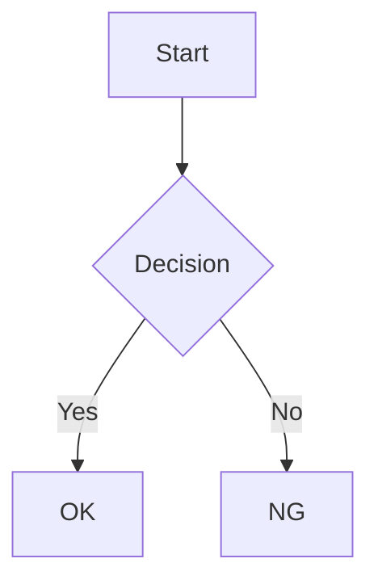

# ligarb 詳細仕様

## 概要

ligarb は、複数の Markdown ファイルを単一の HTML ファイル（`index.html`）に変換する CLI ツールです。

## book.yml

### フィールド

| フィールド | 型 | 必須 | デフォルト | 説明 |
|-----------|-----|------|-----------|------|
| `title` | String | はい | — | 本のタイトル |
| `author` | String | いいえ | `""` | 著者名 |
| `language` | String | いいえ | `"en"` | HTML の `lang` 属性 |
| `output_dir` | String | いいえ | `"build"` | 出力ディレクトリ（book.yml からの相対パス） |
| `chapter_numbers` | Boolean | いいえ | `true` | 目次に章番号を表示するか |
| `style` | String | いいえ | — | カスタム CSS ファイルのパス |
| `repository` | String | いいえ | — | GitHub リポジトリの URL（編集リンク用） |
| `chapters` | Array | はい | — | 本の構成（章・パート・付録） |

### パスの解決

`chapters`、`output_dir`、`style` のパスは、`book.yml` のあるディレクトリからの相対パスとして解決されます。

### chapters の構成

`chapters` 配列には以下の 4 種類の要素を含めることができる。

#### 1. 表紙（cover）

本の表紙ページ。センタリングされたタイトルページとして表示される。TOC には表示されない。

```yaml
chapters:
  - cover: cover.md
```

`cover.md` の h1 がタイトル、本文が表紙の内容となる。

#### 2. 章（文字列）

Markdown ファイルパスを直接指定する。

```yaml
chapters:
  - 01-introduction.md
  - 02-getting-started.md
```

#### 3. パート（part）

複数の章をグループ化する。`part` に指定した Markdown ファイルの h1 がパートタイトル、本文が扉ページとなる。

```yaml
chapters:
  - part: part1.md
    chapters:
      - 01-introduction.md
      - 02-getting-started.md
  - part: part2.md
    chapters:
      - 03-advanced.md
```

- パートをまたいで章番号は通し番号（1, 2, 3, ...）
- TOC にはパートタイトルが見出しとして表示される

#### 4. 付録（appendix）

巻末の付録。章番号がアルファベット（A, B, C, ...）になる。

```yaml
chapters:
  - appendix:
    - a1-references.md
    - a2-glossary.md
```

#### 組み合わせ例

```yaml
chapters:
  - cover: cover.md
  - part: part1.md
    chapters:
      - 01-introduction.md
      - 02-getting-started.md
  - part: part2.md
    chapters:
      - 03-advanced.md
      - 04-deployment.md
  - appendix:
    - a1-config-reference.md
```

表紙は TOC に表示されない。この場合の目次:

```
基本編                    ← part1.md の h1
  1. はじめに
  2. 入門
応用編                    ← part2.md の h1
  3. 応用
  4. デプロイ
付録
  A. 設定リファレンス
```

## Markdown

### パーサー

kramdown (GFM モード) を使用。GitHub Flavored Markdown に準拠。

### 見出しと目次

- `h1`〜`h3` が目次（サイドバー）に表示される
- 各章の最初の `h1` がその章のタイトルとなる
- 見出しの `id` は `{章slug}--{見出しテキスト}` の形式で生成

### 章のスラッグ

Markdown ファイル名から拡張子を除いたものがスラッグになる。
例: `01-introduction.md` → `01-introduction`

## 画像

### 配置

`book.yml` と同じディレクトリの `images/` に配置する。

### パス書き換え

Markdown 内の相対画像パスは、出力 HTML では `images/ファイル名` に書き換えられる。
絶対 URL (`http://`, `https://`) や data URI はそのまま維持される。

### コピー

ビルド時に `images/` ディレクトリの全ファイルが出力先の `images/` にコピーされる。

## コードブロックと外部アセット

Markdown のフェンスドコードブロック（` ``` `）で以下の機能が自動的に有効になる。
使用されている場合のみ、ビルド時に必要な JS/CSS をダウンロードして `build/` に配置する。

| fence 名 | 機能 | ライブラリ | ライセンス |
|-----------|------|-----------|-----------|
| ` ```ruby` 等の言語名 | シンタックスハイライト | [highlight.js](https://highlightjs.org/) | BSD-3-Clause |
| ` ```mermaid` | ダイアグラム（フローチャート、シーケンス図等） | [mermaid](https://mermaid.js.org/) | MIT |
| ` ```math` | 数式（LaTeX 記法） | [KaTeX](https://katex.org/) | MIT |

### 動作の仕組み

- ビルド時に Markdown 内のコードブロックをスキャンし、使用されている機能を検出
- 必要な JS/CSS ファイルを `build/js/` と `build/css/` に自動ダウンロード（既にあればスキップ）
- HTML から相対パスで参照
- 使われていない機能の JS/CSS は含まれない

### 出力ディレクトリ構成

```
build/
├── index.html
├── js/                    # 使用時のみ生成
│   ├── highlight.min.js
│   ├── mermaid.min.js
│   └── katex.min.js
├── css/                   # 使用時のみ生成
│   ├── highlight.css
│   └── katex.min.css
└── images/
```

### 使用例

シンタックスハイライト:

````markdown
```ruby
def hello
  puts "Hello, world!"
end
```
````

ダイアグラム:

````markdown

````

数式:

````markdown
```math
E = mc^2
```
````

## 出力 HTML

### 構造

- 単一の HTML ファイル（CSS・JS 埋め込み）
- 左サイドバー: 目次ツリー + 検索窓
- メイン領域: 章ごとの `<section>` で構成

### 章の表示切り替え

JavaScript で `display: none/block` を切り替え。
初期表示は URL ハッシュがあればその章、なければ最初の章。

### パーマリンク

- `#chapter-slug` — 章の表示
- `#chapter-slug--heading-id` — 章内の見出しへのスクロール

### レスポンシブ

768px 以下でサイドバーをハンバーガーメニュー化。

### 印刷

印刷時はサイドバーを非表示にし、全章を展開表示。

## CLI コマンド

```
ligarb init [DIRECTORY]  新しい本プロジェクトの雛形を生成
ligarb build [CONFIG]    HTML を生成（CONFIG のデフォルトは book.yml）
ligarb help              詳細なヘルプを表示
ligarb version           バージョンを表示
```

### ligarb init

新しい本プロジェクトのディレクトリ構造と設定ファイルを生成する。

- `ligarb init` — カレントディレクトリに生成
- `ligarb init my-book` — `my-book/` を作成してその中に生成

#### 生成されるファイル

- `book.yml` — 設定ファイル（タイトルはディレクトリ名から推測）
- `01-introduction.md` — サンプル章（既存の `.md` ファイルがなければ生成）
- `images/.gitkeep` — 画像用の空ディレクトリ

既存の `.md` ファイルがある場合は、それらを章として `book.yml` に登録する。

#### 注意事項

- `book.yml` が既に存在する場合はエラーで中断（上書きしない）
- ディレクトリが存在しない場合は自動作成

## 脚注

kramdown の脚注記法に対応。

```markdown
テキスト[^1]。

[^1]: 脚注の内容。
```

脚注の ID は章ごとにスコープされるため、複数の章で同じ脚注番号を使っても衝突しない。

## カスタム CSS

`book.yml` に `style` フィールドを指定すると、デフォルトスタイルの後にカスタム CSS が読み込まれる。

```yaml
style: "custom.css"
```

CSS カスタムプロパティ（`--color-accent` 等）を上書きすることで、色やフォント、サイドバー幅などをカスタマイズできる。

## ダークモード

サイドバーヘッダーにダークモード切り替えボタンを表示。ユーザーの設定は `localStorage` に保存され、ページ再読み込み後も維持される。

カスタム CSS でダークモードの色を変更する場合は `[data-theme="dark"]` セレクタを使用する。

## GitHub リンク

`book.yml` に `repository` フィールドを指定すると、各章の末尾に「View on GitHub」リンクが表示される。

```yaml
repository: "https://github.com/user/repo"
```

リンク先は `{repository}/blob/HEAD/{Git ルートからの相対パス}` となる。
Git リポジトリのルートを自動検出し、章ファイルのパスをリポジトリルートからの相対パスとして解決する。
`HEAD` を使うためブランチ名の指定は不要。

## 前後の章ナビゲーション

各章の末尾に「前の章」「次の章」へのナビゲーションリンクが表示される。パートの扉ページにはナビゲーションは表示されない。
