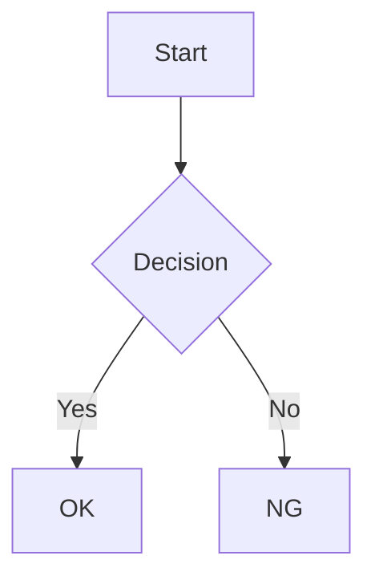

# ligarb 詳細仕様

## 概要

ligarb は、複数の Markdown ファイルを単一の HTML ファイル（`index.html`）に変換する CLI ツールです。

## book.yml

### フィールド

| フィールド | 型 | 必須 | デフォルト | 説明 |
|-----------|-----|------|-----------|------|
| `title` | String | はい | — | 本のタイトル |
| `author` | String | いいえ | `""` | 著者名 |
| `language` | String | いいえ | `"en"` | HTML の `lang` 属性 |
| `output_dir` | String | いいえ | `"build"` | 出力ディレクトリ（book.yml からの相対パス） |
| `chapter_numbers` | Boolean | いいえ | `true` | 目次に章番号を表示するか |
| `style` | String | いいえ | — | カスタム CSS ファイルのパス |
| `repository` | String | いいえ | — | GitHub リポジトリの URL（編集リンク用） |
| `ai_generated` | Boolean | いいえ | `false` | AI 生成コンテンツとしてマーク |
| `footer` | String | いいえ | — | 各章の末尾に表示するテキスト |
| `chapters` | Array | はい | — | 本の構成（章・パート・付録） |

### パスの解決

`chapters`、`output_dir`、`style` のパスは、`book.yml` のあるディレクトリからの相対パスとして解決されます。

### chapters の構成

`chapters` 配列には以下の 4 種類の要素を含めることができる。

#### 1. 表紙（cover）

本の表紙ページ。センタリングされたタイトルページとして表示される。TOC には表示されない。

```yaml
chapters:
  - cover: cover.md
```

`cover.md` の h1 がタイトル、本文が表紙の内容となる。

#### 2. 章（文字列）

Markdown ファイルパスを直接指定する。

```yaml
chapters:
  - 01-introduction.md
  - 02-getting-started.md
```

#### 3. パート（part）

複数の章をグループ化する。`part` に指定した Markdown ファイルの h1 がパートタイトル、本文が扉ページとなる。

```yaml
chapters:
  - part: part1.md
    chapters:
      - 01-introduction.md
      - 02-getting-started.md
  - part: part2.md
    chapters:
      - 03-advanced.md
```

- パートをまたいで章番号は通し番号（1, 2, 3, ...）
- TOC にはパートタイトルが見出しとして表示される

#### 4. 付録（appendix）

巻末の付録。章番号がアルファベット（A, B, C, ...）になる。

```yaml
chapters:
  - appendix:
    - a1-references.md
    - a2-glossary.md
```

#### 組み合わせ例

```yaml
chapters:
  - cover: cover.md
  - part: part1.md
    chapters:
      - 01-introduction.md
      - 02-getting-started.md
  - part: part2.md
    chapters:
      - 03-advanced.md
      - 04-deployment.md
  - appendix:
    - a1-config-reference.md
```

表紙は TOC に表示されない。この場合の目次:

```
基本編                    ← part1.md の h1
  1. はじめに
  2. 入門
応用編                    ← part2.md の h1
  3. 応用
  4. デプロイ
付録
  A. 設定リファレンス
```

## Markdown

### パーサー

kramdown (GFM モード) を使用。GitHub Flavored Markdown に準拠。

### 見出しと目次

- `h1`〜`h3` が目次（サイドバー）に表示される
- 各章の最初の `h1` がその章のタイトルとなる
- 見出しの `id` は `{章slug}--{見出しテキスト}` の形式で生成

### 章のスラッグ

Markdown ファイル名から拡張子を除いたものがスラッグになる。
例: `01-introduction.md` → `01-introduction`

## 画像

### 配置

`book.yml` と同じディレクトリの `images/` に配置する。

### パス書き換え

Markdown 内の相対画像パスは、出力 HTML では `images/ファイル名` に書き換えられる。
絶対 URL (`http://`, `https://`) や data URI はそのまま維持される。

### コピー

ビルド時に `images/` ディレクトリの全ファイルが出力先の `images/` にコピーされる。

## コードブロックと外部アセット

Markdown のフェンスドコードブロック（` ``` `）で以下の機能が自動的に有効になる。
使用されている場合のみ、ビルド時に必要な JS/CSS をダウンロードして `build/` に配置する。

| fence 名 | 機能 | ライブラリ | ライセンス |
|-----------|------|-----------|-----------|
| ` ```ruby` 等の言語名 | シンタックスハイライト | [highlight.js](https://highlightjs.org/) | BSD-3-Clause |
| ` ```mermaid` | ダイアグラム（フローチャート、シーケンス図等） | [mermaid](https://mermaid.js.org/) | MIT |
| ` ```math` | 数式（LaTeX 記法） | [KaTeX](https://katex.org/) | MIT |

### 動作の仕組み

- ビルド時に Markdown 内のコードブロックをスキャンし、使用されている機能を検出
- 必要な JS/CSS ファイルを `build/js/` と `build/css/` に自動ダウンロード（既にあればスキップ）
- HTML から相対パスで参照
- 使われていない機能の JS/CSS は含まれない

### 出力ディレクトリ構成

```
build/
├── index.html
├── js/                    # 使用時のみ生成
│   ├── highlight.min.js
│   ├── mermaid.min.js
│   └── katex.min.js
├── css/                   # 使用時のみ生成
│   ├── highlight.css
│   └── katex.min.css
└── images/
```

### 使用例

シンタックスハイライト:

````markdown
```ruby
def hello
  puts "Hello, world!"
end
```
````

ダイアグラム:

````markdown

````

数式（ブロック）:

````markdown
```math
E = mc^2
```
````

インライン数式:

```markdown
有名な式 $E = mc^2$ を考える。
```

`$...$` で囲むとインライン数式になる。以下のルールに従う:

- `$$` はマッチしない（ブロック数式は ` ```math ` を使う）
- `$` の直後にスペースがある場合はマッチしない（例: `$10`）
- `$` の直前にスペースがある場合はマッチしない
- `<code>` / `<pre>` 内の `$` は変換されない
- KaTeX で `displayMode: false` としてレンダリングされる

## 出力 HTML

### 構造

- 単一の HTML ファイル（CSS・JS 埋め込み）
- 左サイドバー: 目次ツリー + 検索窓
- メイン領域: 章ごとの `<section>` で構成

### 章の表示切り替え

JavaScript で `display: none/block` を切り替え。
初期表示は URL ハッシュがあればその章、なければ最初の章。

### パーマリンク

- `#chapter-slug` — 章の表示
- `#chapter-slug--heading-id` — 章内の見出しへのスクロール

### レスポンシブ

768px 以下でサイドバーをハンバーガーメニュー化。

### 印刷

印刷時はサイドバーを非表示にし、全章を展開表示。

## CLI コマンド

```
ligarb init [DIRECTORY]      新しい本プロジェクトの雛形を生成
ligarb build [CONFIG]        HTML を生成（CONFIG のデフォルトは book.yml）
ligarb serve [CONFIG]        ローカルサーバーでプレビュー＆レビュー（デフォルト: ポート 3000）
ligarb write [BRIEF]         AI（Claude）で本を自動生成（BRIEF のデフォルトは brief.yml）
ligarb write --init [DIR]    DIR/brief.yml のひな形を生成（省略時はカレント）
ligarb help                  詳細なヘルプを表示
ligarb version               バージョンを表示
```

### ligarb serve

ローカル Web サーバーを起動し、ビルド済みの本をプレビューする。テキスト選択→コメント→AI レビュー→承認→ソース修正の一連のフローをブラウザ内で完結できる。

```
ligarb serve [CONFIG]           ローカルサーバーを起動（CONFIG のデフォルトは book.yml）
ligarb serve --port 8080        ポート指定（デフォルト: 3000）
```

#### 起動時の動作

- `ligarb build` を実行してから配信を開始する（常に最新のビルド）

#### ライブリロード

- ビルド出力（`index.html`）の変更を監視し、更新時にリロードボタンを表示
- Linux では inotify（Fiddle 経由）で即座に検知。その他の OS では 2 秒間隔の mtime ポーリングにフォールバック
- リロードボタンをクリックすると、パネルやスクロール位置を維持したままコンテンツを差し替え

#### レビュー UI

ブラウザ上で本文にコメントを付け、Claude と議論し、承認した変更をソースに反映する仕組み。

1. **テキスト選択→コメント**: `.chapter` 内のテキストを選択すると「Comment」ボタンが表示。クリックでサイドパネルが開く
2. **Claude レビュー**: コメントを送信すると Claude（Opus）がソースファイルを読み、改善提案を返す。提案には `<patch>` ブロック（具体的な差分）が含まれる
3. **パッチ確認**: メッセージ内の「Show patch」ボタンで diff（削除=赤 / 追加=緑）を表示
4. **承認**: 「Approve」ボタンでパッチを機械的に適用し、自動リビルド
5. **却下**: 「Dismiss」ボタンでスレッドを閉じる

#### データ保存

- レビュースレッドは `.ligarb/reviews/{uuid}.json` に保存
- 各スレッドには status（`open` / `applied` / `closed`）、コンテキスト（章、選択テキスト）、メッセージ履歴が含まれる

#### マルチブックモードでの AI 執筆

マルチブックモード（2+ CONFIG）のトップページに「Write a new book」ボタンを表示。フォームから brief を入力し、バックグラウンドで Writer を実行して本を生成する。

1. フォームに Directory（slug）、Title、Language、Audience、Notes を入力
2. POST `/_ligarb/write` で `brief.yml` を生成し、Writer をバックグラウンドで起動
3. 左ペインに「Writing...」バッジ（パルスアニメーション）付きで表示
4. 完了: 「New!」バッジに変わり、クリックで TOC 表示可能。ページリロードで正式に books に追加
5. エラー: 「Error」バッジでエラー内容を確認可能

SSE の `write_updated` イベントでリアルタイムにステータスを通知する。

#### API

サーバーは `/_ligarb/` プレフィックスで内部 API を提供する。

| メソッド | パス | 説明 |
|---------|------|------|
| GET | `/_ligarb/status` | `{mtime: <epoch>}` — ビルド出力の更新検知 |
| GET | `/_ligarb/events` | SSE ストリーム — `build_updated` / `review_updated` / `write_updated` イベント |
| GET | `/_ligarb/assets/:file` | 注入用 JS/CSS の配信 |
| GET | `/_ligarb/reviews` | スレッド一覧 |
| GET | `/_ligarb/reviews/:id` | スレッド詳細 |
| POST | `/_ligarb/reviews` | 新規スレッド作成 → Claude 起動 |
| POST | `/_ligarb/reviews/:id/messages` | 返信追加 → Claude 起動 |
| POST | `/_ligarb/reviews/:id/approve` | パッチ適用 → リビルド |
| DELETE | `/_ligarb/reviews/:id` | スレッドを閉じる |
| POST | `/_ligarb/write` | AI 執筆開始（マルチブックモードのみ）。brief データ送信 → バックグラウンドで Writer 実行 |
| GET | `/_ligarb/write/status` | 全 write ジョブのステータス一覧 |

マルチブックモードでは、パス中にスラッグが入る（例: `/_ligarb/{slug}/reviews`）。`/_ligarb/write` と `/_ligarb/write/status` はグローバル API（slug 不要）。

#### 前提条件

レビュー機能と AI 執筆機能を使うには [Claude Code](https://claude.com/claude-code) の CLI（`claude` コマンド）が必要。サーバー配信・ライブリロードだけなら不要。

### ligarb write

AI（Claude CLI）を使って、企画書（`brief.yml`）から本を自動生成する。

- `ligarb write --init ruby_book` — `ruby_book/brief.yml` のひな形を生成（ディレクトリも作成）
- `ligarb write --init` — カレントディレクトリに `brief.yml` を生成
- `ligarb write ruby_book/brief.yml` — `ruby_book/` に本を生成し、ビルドまで実行
- `ligarb write` — カレントの `brief.yml` を読んで本を生成
- `ligarb write --no-build` — 生成のみ（ビルドしない）

#### brief.yml

| フィールド | 必須 | 用途 | 説明 |
|-----------|------|------|------|
| `title` | はい | brief + book.yml | 本のタイトル |
| `language` | いいえ | brief + book.yml | 言語（デフォルト: `"ja"`） |
| `audience` | いいえ | brief のみ | 対象読者（プロンプトに使用） |
| `notes` | いいえ | brief のみ | 追加の指示・要望（自由記述） |
| `author` | いいえ | book.yml に反映 | 著者名 |
| `output_dir` | いいえ | book.yml に反映 | 出力ディレクトリ |
| `chapter_numbers` | いいえ | book.yml に反映 | 章番号の表示 |
| `style` | いいえ | book.yml に反映 | カスタム CSS パス |
| `repository` | いいえ | book.yml に反映 | GitHub リポジトリ URL |

`title` だけあれば動作する。最小限は `title: "テーマ"` の 1 行。

#### 出力先

`brief.yml` のあるディレクトリに本のファイル（`book.yml`、章の `.md` ファイル）が生成される。例: `ligarb write ruby_book/brief.yml` → `ruby_book/` に生成。

#### エラー

- `claude` コマンドが見つからない → エラー終了
- `brief.yml` が見つからない → エラー終了
- `title` がない → バリデーションエラー
- 出力先に `book.yml` が既存 → 中断（上書き防止）
- Claude プロセスが失敗 → エラー終了
- `book.yml` が生成されなかった → エラー終了

#### 前提条件

[Claude Code](https://claude.com/claude-code) の CLI（`claude` コマンド）がインストールされている必要がある。

### ligarb init

新しい本プロジェクトのディレクトリ構造と設定ファイルを生成する。

- `ligarb init` — カレントディレクトリに生成
- `ligarb init my-book` — `my-book/` を作成してその中に生成

#### 生成されるファイル

- `book.yml` — 設定ファイル（タイトルはディレクトリ名から推測）
- `01-introduction.md` — サンプル章（既存の `.md` ファイルがなければ生成）
- `images/.gitkeep` — 画像用の空ディレクトリ

既存の `.md` ファイルがある場合は、それらを章として `book.yml` に登録する。

#### 注意事項

- `book.yml` が既に存在する場合はエラーで中断（上書きしない）
- ディレクトリが存在しない場合は自動作成

## 脚注

kramdown の脚注記法に対応。

```markdown
テキスト[^1]。

[^1]: 脚注の内容。
```

脚注の ID は章ごとにスコープされるため、複数の章で同じ脚注番号を使っても衝突しない。

## 索引（Index）

Markdown のリンク記法を使って索引語をマークする。本の末尾に索引セクションが自動生成される。

### 記法

| 記法 | 表示 | 索引に登録される語 |
|------|------|-------------------|
| `[Ruby](#index)` | Ruby | Ruby |
| `[動的型付け言語](#index:動的型付け)` | 動的型付け言語 | 動的型付け |
| `[Ruby](#index:Ruby,プログラミング言語/Ruby)` | Ruby | Ruby、プログラミング言語 > Ruby |

### 動作

- `<a href="#index...">` が kramdown により生成される
- ビルド時にリンクを検出し、索引エントリとして収集、`<a>` タグは `<span>` に置換（リンクスタイルにならない）
- 各マーカーの位置にアンカー ID を付与し、索引からジャンプ可能にする
- `/` で区切った索引語は階層構造でグルーピングされる（例: `外部ライブラリ/Mermaid` → 「外部ライブラリ」の下に「Mermaid」）
- 索引エントリがない場合、索引セクションは生成されない

## カスタム CSS

`book.yml` に `style` フィールドを指定すると、デフォルトスタイルの後にカスタム CSS が読み込まれる。

```yaml
style: "custom.css"
```

CSS カスタムプロパティ（`--color-accent` 等）を上書きすることで、色やフォント、サイドバー幅などをカスタマイズできる。

## ダークモード

サイドバーヘッダーにダークモード切り替えボタンを表示。ユーザーの設定は `localStorage` に保存され、ページ再読み込み後も維持される。

カスタム CSS でダークモードの色を変更する場合は `[data-theme="dark"]` セレクタを使用する。

## GitHub リンク

`book.yml` に `repository` フィールドを指定すると、各章の末尾に「View on GitHub」リンクが表示される。

```yaml
repository: "https://github.com/user/repo"
```

リンク先は `{repository}/blob/HEAD/{Git ルートからの相対パス}` となる。
Git リポジトリのルートを自動検出し、章ファイルのパスをリポジトリルートからの相対パスとして解決する。
`HEAD` を使うためブランチ名の指定は不要。

## Admonition（注意書きボックス）

GFM の blockquote alert 記法を検出し、スタイル付きのボックスに変換する。

### 対応タイプ

| タイプ | 色 | 用途 |
|--------|-----|------|
| `NOTE` | 青 | 補足情報 |
| `TIP` | 緑 | 役立つアドバイス |
| `WARNING` | 黄 | 注意事項 |
| `CAUTION` | 赤 | 危険な操作 |
| `IMPORTANT` | 紫 | 重要な情報 |

### 記法

```markdown
> [!NOTE]
> これは補足情報です。

> [!WARNING]
> この操作は元に戻せません。
```

### 動作

- kramdown が出力する `<blockquote>` 内の `[!TYPE]` パターンを検出
- `<blockquote>` を `<div class="admonition admonition-{type}">` に変換
- タイプ名をタイトルとして `<p class="admonition-title">` を挿入
- 通常の blockquote（`[!TYPE]` なし）は変換しない
- 各タイプに左ボーダー色・背景色・アイコンを設定（ダークモード対応）

## 相互参照（Cross-References）

Markdown の相対リンク記法を使って、他の章や見出しへのリンクを作成できる。ビルド時に `.md` ファイルへのリンクを単一 HTML 内のアンカーに変換する。

### 記法

| 記法 | 説明 |
|------|------|
| `[テキスト](other.md)` | 章へのリンク |
| `[テキスト](other.md#見出し)` | 特定の見出しへのリンク |
| `[](other.md)` | 章タイトルを自動挿入 |
| `[](other.md#見出し)` | 見出しテキストを自動挿入 |

### パス解決

`.md` のパスは、現在の Markdown ファイルのディレクトリからの相対パスとして解決される。

### 見出しフラグメント

`#` 以降の見出しフラグメントは、見出し ID の生成と同じ正規化処理（小文字化、記号除去、空白をハイフンに変換）を経てマッチングされる。

### 自動テキスト

リンクテキストが空（`[]`）の場合、リンク先の情報が自動的に埋められる:

- 章リンク: `display_title`（例: `3. 設定ガイド`）
- 見出しリンク: `display_text`（例: `3.2 セットアップ`）

### エラー

参照先の章ファイルまたは見出しが見つからない場合、ビルドはエラーで失敗する。エラーメッセージには壊れた参照と参照元ファイルが表示される。

### 外部 URL

`https://example.com/README.md` のような外部 URL は相互参照の対象にならない（相対パスのみ対象）。

## 前後の章ナビゲーション

各章の末尾に「前の章」「次の章」へのナビゲーションリンクが表示される。表紙（cover）にはナビゲーションは表示されない。

## AI 生成コンテンツ表示

`ai_generated: true` を `book.yml` に設定すると、以下が有効になる:

- サイドバーヘッダーに「AI 生成」バッジ（英語の場合は「AI Generated」）
- 各章の末尾に注意喚起テキスト
- `<meta name="robots" content="noindex, nofollow, noarchive">` で検索エンジンのインデックスを抑止
- `<meta name="robots" content="noai, noimageai">` で AI クローラーの学習利用を抑止

```yaml
ai_generated: true
```

`ligarb write` で生成した本には自動的に `ai_generated: true` が設定される。

## チャプターフッター

`footer` フィールドを指定すると、各章の末尾に任意のテキストを表示できる。

```yaml
footer: "© 2026 Author Name. All rights reserved."
```

`ai_generated: true` と `footer` の両方が指定された場合、`footer` のテキストが優先される（デフォルトの AI 注意文言を上書き）。
