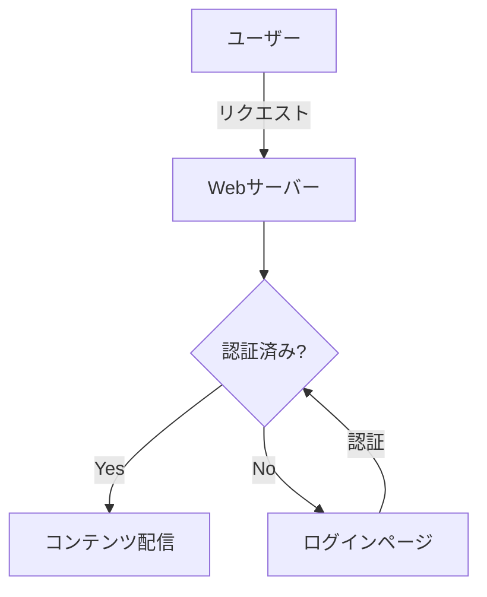
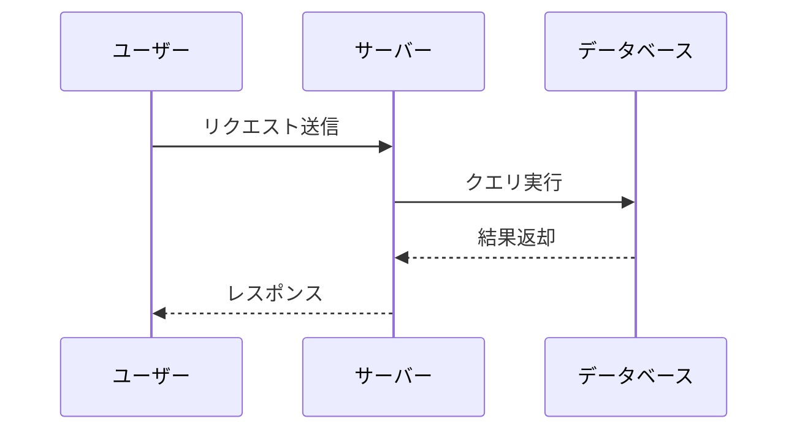

# Markdown の書き方と画像の配置

## 対応する Markdown 記法

ligarb は GitHub Flavored Markdown (GFM) に対応しています。以下の記法が使えます。

### 見出し

見出しは `#` で記述します。`h1`〜`h3` が目次に表示されます:

```markdown
# 章タイトル（h1）
## セクション（h2）
### サブセクション（h3）
```

> 各章の最初の `h1` がその章のタイトルとして目次に表示されます。

### コードブロック

バッククォート3つで囲むと、コードブロックになります。
言語名を指定すると、自動的にシンタックスハイライトが適用されます:

```ruby
def greet(name)
  puts "Hello, #{name}!"
end
```

```python
def fibonacci(n):
    a, b = 0, 1
    for _ in range(n):
        a, b = b, a + b
    return a
```

```javascript
const fetchData = async (url) => {
  const response = await fetch(url);
  return response.json();
};
```

> シンタックスハイライトには [highlight.js](https://highlightjs.org/) が使われます。
> 言語指定のあるコードブロックが Markdown 内にある場合のみ、
> ビルド時に自動でダウンロードされます。

### ダイアグラム（mermaid）

` ```mermaid` で [Mermaid](https://mermaid.js.org/) のダイアグラムを描けます。
フローチャート、シーケンス図、クラス図など多くの図に対応しています。

フローチャート:



シーケンス図:



> Mermaid の詳しい記法は [公式ドキュメント](https://mermaid.js.org/intro/) を参照してください。

### 数式（KaTeX）

` ```math` で [KaTeX](https://katex.org/) による数式レンダリングが使えます。
LaTeX 記法で数式を記述します。

二次方程式の解の公式:

```math
x = \frac{-b \pm \sqrt{b^2 - 4ac}}{2a}
```

ガウス積分:

```math
\int_{-\infty}^{\infty} e^{-x^2} dx = \sqrt{\pi}
```

行列:

```math
A = \begin{pmatrix} a_{11} & a_{12} \\ a_{21} & a_{22} \end{pmatrix}
```

> これらの外部ライブラリは、該当するコードブロックが Markdown 内に存在する場合のみ
> ビルド時に自動的にダウンロードされ、`build/js/` と `build/css/` に配置されます。
> 既にダウンロード済みであればスキップされます。

### テーブル

GFM のテーブル記法が使えます:

| 列1 | 列2 | 列3 |
|-----|-----|-----|
| A   | B   | C   |

### リスト

通常のリストとタスクリストに対応しています:

- 項目 1
- 項目 2
  - ネストも可能

1. 番号付きリスト
2. 二番目

### 引用

```markdown
> これは引用です。
> 複数行に渡ることもできます。
```

### 脚注

テキスト中に脚注を挿入できます[^1]。複数の脚注も使えます[^2]。

```markdown
テキスト中に脚注を挿入できます[^1]。

[^1]: これが脚注の内容です。
```

脚注の ID は章ごとにスコープされるため、異なる章で同じ番号を使っても衝突しません。

[^1]: これが脚注の内容です。脚注はページ下部にまとめて表示されます。
[^2]: 複数の脚注を使うこともできます。

## 画像の配置

### ディレクトリ

画像ファイルは `images/` ディレクトリに配置します:

```
my-book/
├── book.yml
├── chapters/
│   └── 01-introduction.md
└── images/
    ├── screenshot.png
    └── diagram.svg
```

### Markdown での参照

Markdown 内では相対パスで画像を参照します:

```markdown

```

ligarb はビルド時に画像パスを `images/ファイル名` に書き換え、
`images/` ディレクトリの中身を出力先にコピーします。

### 対応フォーマット

PNG, JPEG, SVG, GIF などの一般的な画像フォーマットが使えます。
画像はそのままコピーされるため、変換や最適化は行いません。
