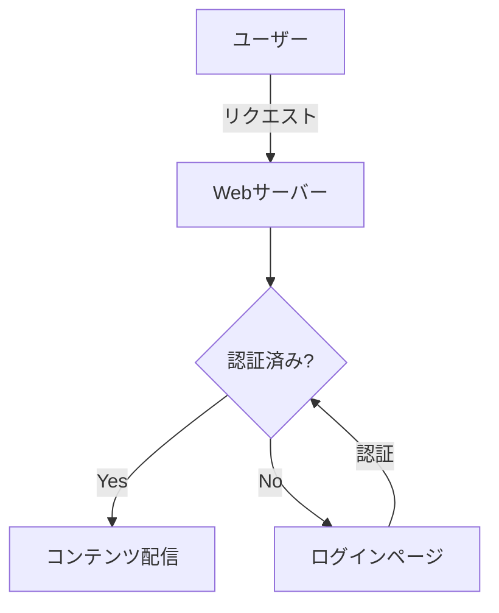
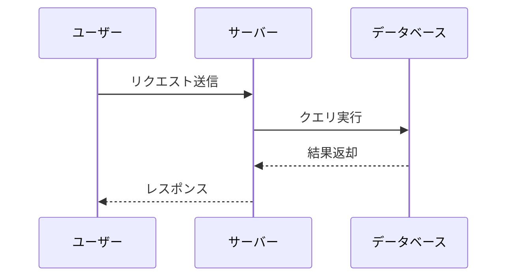

# Markdown の書き方と画像の配置

## 対応する Markdown 記法

ligarb は [GitHub Flavored Markdown](#index:GFM) (GFM) に対応しています。以下の記法が使えます。

### 見出し

[見出し](#index:見出し)は `#` で記述します。`h1`〜`h3` が目次に表示されます:

```markdown
# 章タイトル（h1）
## セクション（h2）
### サブセクション（h3）
```

> 各章の最初の `h1` がその章のタイトルとして目次に表示されます。

### コードブロック

バッククォート3つで囲むと、[コードブロック](#index:コードブロック)になります。
言語名を指定すると、自動的に[シンタックスハイライト](#index:シンタックスハイライト)が適用されます:

```ruby
def greet(name)
  puts "Hello, #{name}!"
end
```

```python
def fibonacci(n):
    a, b = 0, 1
    for _ in range(n):
        a, b = b, a + b
    return a
```

```javascript
const fetchData = async (url) => {
  const response = await fetch(url);
  return response.json();
};
```

> シンタックスハイライトには [highlight.js](https://highlightjs.org/) が使われます。
> 言語指定のあるコードブロックが Markdown 内にある場合のみ、
> ビルド時に自動でダウンロードされます。

### ダイアグラム（mermaid）

` ```mermaid` で [Mermaid](https://mermaid.js.org/) のダイアグラムを描けます。
フローチャート、シーケンス図、クラス図など多くの図に対応しています。

フローチャート:



シーケンス図:



> Mermaid の詳しい記法は [公式ドキュメント](https://mermaid.js.org/intro/) を参照してください。

### 数式（KaTeX）

` ```math` で [KaTeX](https://katex.org/) による数式レンダリングが使えます。
LaTeX 記法で数式を記述します。

二次方程式の解の公式:

```math
x = \frac{-b \pm \sqrt{b^2 - 4ac}}{2a}
```

ガウス積分:

```math
\int_{-\infty}^{\infty} e^{-x^2} dx = \sqrt{\pi}
```

行列:

```math
A = \begin{pmatrix} a_{11} & a_{12} \\ a_{21} & a_{22} \end{pmatrix}
```

> これらの外部ライブラリは、該当するコードブロックが Markdown 内に存在する場合のみ
> ビルド時に自動的にダウンロードされ、`build/js/` と `build/css/` に配置されます。
> 既にダウンロード済みであればスキップされます。

### インライン数式

文中に数式を埋め込むには `$...$` で囲みます。例えば、有名な式 $E = mc^2$ はこのように書けます:

```markdown
有名な式 $E = mc^2$ はこのように書けます。
```

二次方程式の解 $x = \frac{-b \pm \sqrt{b^2 - 4ac}}{2a}$ のような複雑な式もインラインで書けます。

> [!NOTE]
> `$` の直後や直前にスペースがある場合は数式として認識されません。
> これにより `$10` のような通貨表記が誤って変換されることを防ぎます。
> また `<code>` や `<pre>` 内の `$` も変換されません。
> ブロック数式には ` ```math ` を使ってください（`$$...$$` は対応していません）。

### テーブル

GFM のテーブル記法が使えます:

| 列1 | 列2 | 列3 |
|-----|-----|-----|
| A   | B   | C   |

### リスト

通常のリストとタスクリストに対応しています:

- 項目 1
- 項目 2
  - ネストも可能

1. 番号付きリスト
2. 二番目

### 引用

```markdown
> これは引用です。
> 複数行に渡ることもできます。
```

### Admonition（注意書きボックス）

GFM の blockquote alert 記法で、スタイル付きの注意書きボックスを作成できます:

> [!NOTE]
> これは補足情報です。読者に追加のコンテキストを提供します。

> [!TIP]
> 役立つアドバイスやベストプラクティスを伝えるときに使います。

> [!WARNING]
> 注意が必要な事項を伝えるときに使います。

> [!CAUTION]
> 危険な操作や取り返しのつかない変更について警告します。

> [!IMPORTANT]
> 重要な情報を強調します。

記法は以下の通りです:

```markdown
> [!NOTE]
> ここに補足情報を書きます。

> [!TIP]
> ここにアドバイスを書きます。

> [!WARNING]
> ここに注意事項を書きます。

> [!CAUTION]
> ここに危険な操作についての警告を書きます。

> [!IMPORTANT]
> ここに重要な情報を書きます。
```

対応するタイプは `NOTE`、`TIP`、`WARNING`、`CAUTION`、`IMPORTANT` の 5 種類です。

### 脚注

テキスト中に[脚注](#index:脚注)を挿入できます[^1]。複数の脚注も使えます[^2]。

```markdown
テキスト中に脚注を挿入できます[^1]。

[^1]: これが脚注の内容です。
```

脚注の ID は章ごとにスコープされるため、異なる章で同じ番号を使っても衝突しません。

[^1]: これが脚注の内容です。脚注はページ下部にまとめて表示されます。
[^2]: 複数の脚注を使うこともできます。

## 画像の配置

### ディレクトリ

[画像](#index:画像)ファイルは `images/` ディレクトリに配置します:

```
my-book/
├── book.yml
├── chapters/
│   └── 01-introduction.md
└── images/
    ├── screenshot.png
    └── diagram.svg
```

### Markdown での参照

Markdown 内では相対パスで画像を参照します:

```markdown

```

ligarb はビルド時に画像パスを `images/ファイル名` に書き換え、
`images/` ディレクトリの中身を出力先にコピーします。

### 対応フォーマット

PNG, JPEG, SVG, GIF などの一般的な画像フォーマットが使えます。
画像はそのままコピーされるため、変換や最適化は行いません。

## 索引（Index）

本の末尾に索引を自動生成できます。Markdown のリンク記法を使って索引語をマークします。

### 基本的な使い方

リンク先に `#index` を指定すると、リンクテキストがそのまま索引語になります:

```markdown
[Ruby](#index) は動的型付け言語です。
```

表示テキストと索引語を別にしたい場合は `#index:索引語` とします:

```markdown
[動的型付け言語](#index:動的型付け)
```

### 複数の索引語

カンマ区切りで一箇所に複数の索引語を登録できます:

```markdown
[Ruby](#index:Ruby,プログラミング言語/Ruby)
```

### 階層化

`/` で区切ると、索引が階層構造になります。例えば `プログラミング言語/Ruby` と書くと:

```
プログラミング言語
  Ruby ......... 4章
```

のように親子でグルーピングされます。

### 実際の例

以下はこのマニュアル内での索引マーカーの例です:

[Markdown](#index) は軽量マークアップ言語です。
[highlight.js](#index:highlight.js,外部ライブラリ/highlight.js) によるシンタックスハイライト、
[Mermaid](#index:Mermaid,外部ライブラリ/Mermaid) によるダイアグラム、
[KaTeX](#index:KaTeX,外部ライブラリ/KaTeX) による数式レンダリングに対応しています。

> 索引マーカーは通常のテキストとして表示され、リンクのスタイルにはなりません。
> 本の末尾に「索引」セクションが自動的に追加されます。

## 相互参照（Cross-References）

他の章や見出しへのリンクを、標準の Markdown リンク記法で作成できます。
ビルド時に `.md` ファイルへの相対リンクが単一 HTML 内のアンカーに変換されます。

### 基本的な使い方

[相互参照](#index:相互参照)は通常の Markdown リンクとして記述します。リンク先に `.md` ファイルを指定すると、ビルド時に自動的に解決されます:

```markdown
[設定の詳細](03-book-yml.md)
```

特定の見出しへリンクするには `#` でフラグメントを指定します:

```markdown
[chapters フィールド](03-book-yml.md#chapters フィールド)
```

### リンクテキストの自動挿入

リンクテキストを空にすると、リンク先の章タイトルや見出しテキスト（番号付き）が自動的に挿入されます:

```markdown
詳しくは [](03-book-yml.md) を参照してください。
設定項目は [](03-book-yml.md#chapters フィールド) で説明しています。
```

上の例では、リンクテキストがそれぞれ「3. book.yml の設定」「3.1 chapters フィールド」のように章番号・セクション番号付きで表示されます。

### パスの解決

`.md` のパスは、現在の Markdown ファイルのディレクトリからの相対パスとして解決されます。同じディレクトリにある章ファイルへはファイル名だけで参照できます。

### エラー検出

参照先の章ファイルや見出しが存在しない場合、ビルドはエラーで停止します:

```
Error: cross-reference target not found: missing.md (from 01-introduction.md)
Error: cross-reference heading not found: 03-book-yml.md#typo (from 04-markdown.md)
```

> [!TIP]
> 相互参照は GitHub 上でも通常の相対リンクとして機能するため、
> GitHub でソースを閲覧する際にもリンクが有効です。
