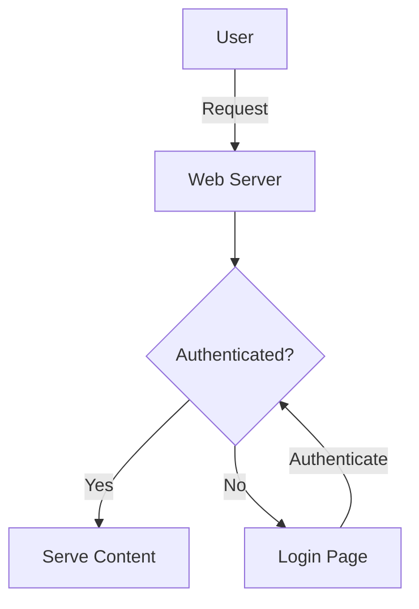
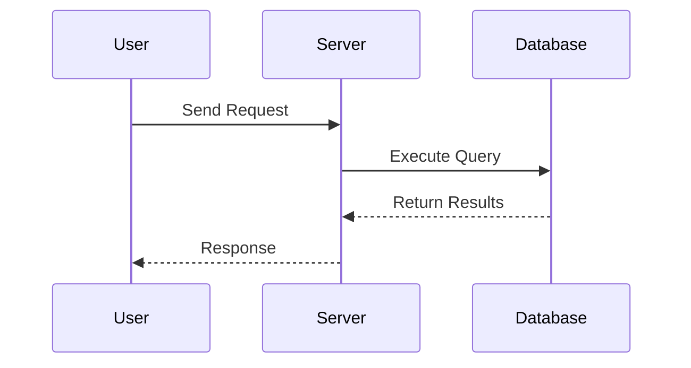
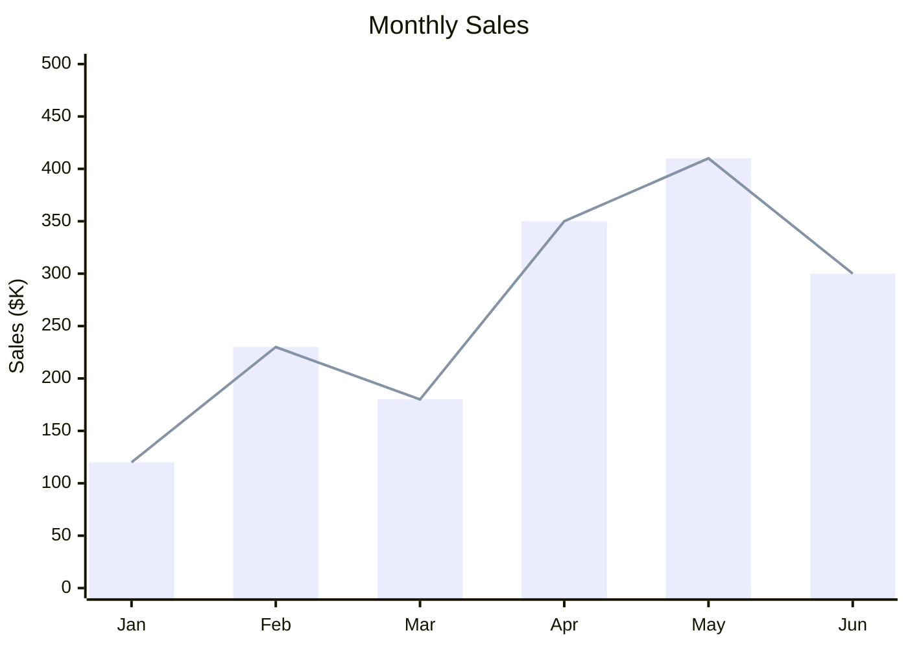
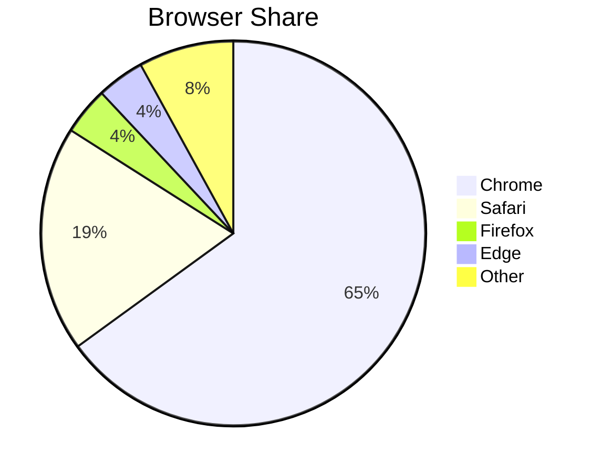
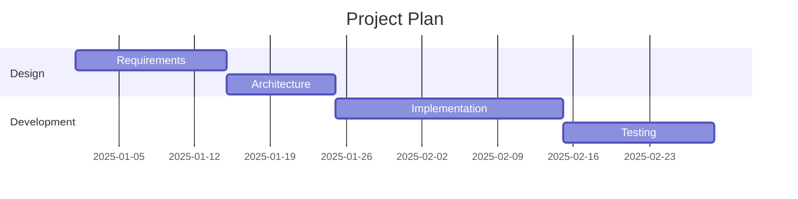
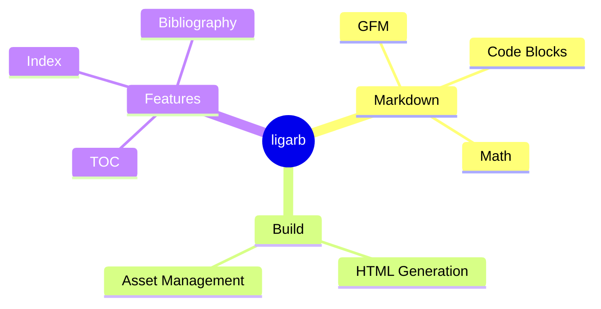

# Markdown Syntax and Images

## Supported Markdown Syntax

ligarb supports [GitHub Flavored Markdown](#index:GFM) ([GFM](#cite:gfm2017)). Markdown is a lightweight markup language [first published by John Gruber in 2004](#cite:gruber2004), and the following syntax is available.

### Headings

[Headings](#index:headings) are written with `#`. `h1` through `h3` appear in the table of contents:

```markdown
# Chapter Title (h1)
## Section (h2)
### Subsection (h3)
```

> The first `h1` in each file becomes the chapter title shown in the TOC.

### Code Blocks

Wrap code with triple backticks to create a [code block](#index:code blocks).
Specifying a language name enables automatic [syntax highlighting](#index:syntax highlighting):

```ruby
def greet(name)
  puts "Hello, #{name}!"
end
```

```python
def fibonacci(n):
    a, b = 0, 1
    for _ in range(n):
        a, b = b, a + b
    return a
```

```javascript
const fetchData = async (url) => {
  const response = await fetch(url);
  return response.json();
};
```

> Syntax highlighting uses [highlight.js](#cite:highlightjs2011).
> It is automatically downloaded at build time only when language-specified
> code blocks are present in the Markdown.

### Diagrams (Mermaid)

Use ` ```mermaid` to draw [Mermaid](https://mermaid.js.org/) diagrams.
Flowcharts, sequence diagrams, class diagrams, and many more are supported.

Flowchart:



Sequence diagram:



Bar chart (`xychart`):



Line chart (`xychart`, `line` only):

```mermaid
xychart
    title "Temperature"
    x-axis ["Jan", "Feb", "Mar", "Apr", "May", "Jun"]
    y-axis "Temp (C)" -5 --> 30
    line [2, 4, 10, 16, 22, 26]
```

Pie chart:



Gantt chart:



Mind map:



> See the [Mermaid documentation](https://mermaid.js.org/intro/) for detailed syntax.

### Math (KaTeX)

Use ` ```math` for math rendering with [KaTeX](#cite:katex2014).
Write equations in [LaTeX](#cite:lamport1994) notation.

Quadratic formula:

```math
x = \frac{-b \pm \sqrt{b^2 - 4ac}}{2a}
```

Gaussian integral:

```math
\int_{-\infty}^{\infty} e^{-x^2} dx = \sqrt{\pi}
```

Matrix:

```math
A = \begin{pmatrix} a_{11} & a_{12} \\ a_{21} & a_{22} \end{pmatrix}
```

### Function Plots (functionplot)

Use ` ```functionplot` to draw function graphs.

```functionplot
y = sin(x)
y = x^2 - 1
range: [-2pi, 2pi]
yrange: [-3, 3]
```

Write one function per line in the `y = <expression>` format:

```functionplot
y = cos(x) * exp(-x/5)
range: [0, 20]
title: Damped Oscillation
grid: true
```

Polar and parametric curves are also supported:

```functionplot
r = cos(2*theta)
```

```functionplot
parametric: cos(t), sin(t)
range: [-2pi, 2pi]
width: 400
height: 400
```

Options are specified as `key: value`:

- `range` / `xrange` -- X-axis range (e.g., `[-2pi, 2pi]`)
- `yrange` -- Y-axis range
- `width` / `height` -- Size in pixels (default: 600x400)
- `title` -- Graph title
- `grid: true` -- Show grid lines

> These external libraries are automatically downloaded at build time only
> when the corresponding code blocks are present in the Markdown.
> They are placed in `build/js/` and `build/css/`.
> Already-downloaded files are skipped.

### Inline Math

Embed math in text by wrapping it with `$...$`. For example, the famous equation $E = mc^2$ is written as:

```markdown
The famous equation $E = mc^2$ is written as follows.
```

Complex expressions like the quadratic formula $x = \frac{-b \pm \sqrt{b^2 - 4ac}}{2a}$ can also be written inline.

> [!NOTE]
> A `$` followed or preceded by a space is not recognized as math.
> This prevents currency notations like `$10` from being converted.
> Content inside `<code>` and `<pre>` is also unaffected.
> For display math, use ` ```math ` (`$$...$$` is not supported).

### Tables

GFM table syntax is supported:

| Col 1 | Col 2 | Col 3 |
|-------|-------|-------|
| A     | B     | C     |

### Lists

Both regular lists and task lists are supported:

- Item 1
- Item 2
  - Nesting is possible

1. Numbered list
2. Second item

### Blockquotes

```markdown
> This is a blockquote.
> It can span multiple lines.
```

### Admonitions

GFM blockquote alert syntax creates styled admonition boxes:

> [!NOTE]
> This is supplemental information that provides additional context.

> [!TIP]
> Use this for helpful advice and best practices.

> [!WARNING]
> Use this for items that need attention.

> [!CAUTION]
> Use this to warn about dangerous or irreversible operations.

> [!IMPORTANT]
> Use this to highlight critical information.

The syntax is as follows:

```markdown
> [!NOTE]
> Write supplemental information here.

> [!TIP]
> Write advice here.

> [!WARNING]
> Write cautions here.

> [!CAUTION]
> Write warnings about dangerous operations here.

> [!IMPORTANT]
> Write important information here.
```

Five types are supported: `NOTE`, `TIP`, `WARNING`, `CAUTION`, and `IMPORTANT`.

### Footnotes

You can insert [footnotes](#index:footnotes) in the text[^1]. Multiple footnotes are also supported[^2].

```markdown
You can insert footnotes in the text[^1].

[^1]: This is the footnote content.
```

Footnote IDs are scoped per chapter, so the same number can be used in different chapters without collision.

[^1]: This is the footnote content. Footnotes are displayed together at the bottom of the page.
[^2]: You can use multiple footnotes.

## Images

### Directory

Place [image](#index:images) files in the `images/` directory:

```
my-book/
├── book.yml
├── chapters/
│   └── 01-introduction.md
└── images/
    ├── screenshot.png
    └── diagram.svg
```

### Referencing in Markdown

Reference images with relative paths in Markdown:

```markdown

```

ligarb rewrites image paths to `images/filename` at build time
and copies the contents of the `images/` directory to the output.

### Supported Formats

Common image formats such as PNG, JPEG, SVG, and GIF are supported.
Images are copied as-is without conversion or optimization.

## Index

An index can be automatically generated at the end of the book. Use Markdown link syntax to mark index terms.

### Basic Usage

Specify `#index` as the link target, and the link text becomes the index term:

```markdown
[Ruby](#index) is a dynamically typed language.
```

To use a different index term from the display text, use `#index:term`:

```markdown
[dynamically typed language](#index:dynamic typing)
```

### Multiple Index Terms

Register multiple index terms from a single location using commas:

```markdown
[Ruby](#index:Ruby,Programming Languages/Ruby)
```

### Hierarchical Index

Use `/` to create hierarchical index entries. For example, `Programming Languages/Ruby` produces:

```
Programming Languages
  Ruby ......... Chapter 4
```

### Example

Here are examples of index markers used in this manual:

[Markdown](#index) is a lightweight markup language.
[highlight.js](#index:highlight.js,External Libraries/highlight.js) provides syntax highlighting,
[Mermaid](#index:Mermaid,External Libraries/Mermaid) provides diagrams,
and [KaTeX](#index:KaTeX,External Libraries/KaTeX) provides math rendering.

> Index markers are displayed as plain text without link styling.
> An "Index" section is automatically added at the end of the book.

## Bibliography

You can cite references in the text and automatically generate a bibliography list at the end of the book.

### Setup

Specify a bibliography data file in `book.yml`. The format is auto-detected by file extension:

```yaml
bibliography: references.yml   # YAML format
bibliography: references.bib   # BibTeX format
```

#### YAML Format

A mapping of keys to reference data:

```yaml
matz1995:
  author: "Yukihiro Matsumoto"
  title: "The Ruby Programming Language"
  year: 1995
  url: "https://www.ruby-lang.org"
  publisher: "O'Reilly"
```

#### BibTeX Format (.bib)

Standard BibTeX notation:

```bibtex
@book{matz1995,
  author = {Yukihiro Matsumoto},
  title = {The Ruby Programming Language},
  year = {1995},
  publisher = {O'Reilly},
  url = {https://www.ruby-lang.org}
}

@article{knuth1984,
  author = {Donald Knuth},
  title = {Literate Programming},
  year = {1984},
  journal = {The Computer Journal},
  volume = {27},
  number = {2},
  pages = {97-111}
}
```

BibTeX notes:

- Lines starting with `%` are treated as comments
- Field values are enclosed in `{...}` or `"..."`
- One level of nested braces is supported (e.g., `{The {Ruby} Language}`)
- Entry types (`@book`, `@article`, etc.) affect the display format

### Supported Fields

The following fields are available for both YAML and BibTeX:

| Field | Purpose |
|-------|---------|
| `author` | Author |
| `title` | Title |
| `year` | Publication year |
| `url` | URL (title becomes a link) |
| `publisher` | Publisher |
| `journal` | Journal name |
| `booktitle` | Book/conference name |
| `volume` | Volume |
| `number` | Issue number |
| `pages` | Pages |
| `edition` | Edition |
| `doi` | DOI (appends a DOI link) |
| `editor` | Editor |
| `note` | Note |

### Display by Entry Type

The bibliography list format varies by BibTeX entry type:

- **book**: Author. *Title*. Edition. Publisher. Year.
- **article**: Author. "Title". *Journal*, Volume(Number), pp. Pages. Year.
- **inproceedings**: Author. "Title". In *Booktitle*, pp. Pages. Year.
- **other/YAML**: Author. *Title*. Publisher. Journal. Volume. Pages. Year.

### Citing References

Specify `#cite:key` as the link target:

```markdown
[Ruby](#cite:matz1995) is a wonderful language.
```

This renders as "Ruby<sup>[Yukihiro, 1995]</sup> is a wonderful language." The superscript `[author, year]` is a link to the bibliography section, and hovering shows the full reference information.

### Example

This manual itself uses the bibliography feature. References are defined in BibTeX format in `manual/references.bib` and cited throughout the text.

[Markdown](#cite:gruber2004) is a lightweight markup language published in 2004. [GitHub later extended it as GFM](#cite:gfm2017), adding features like tables and task lists. Math rendering uses [KaTeX](#cite:katex2014), and syntax highlighting uses [highlight.js](#cite:highlightjs2011). The math notation is based on [Lamport's LaTeX](#cite:lamport1994), and the fusion of documentation and executable code via code blocks is influenced by [Knuth's Literate Programming](#cite:knuth1984). Cross-referencing via hyperlinks is a fundamental concept of [Berners-Lee et al.'s WWW](#cite:berners-lee1992).

> [!TIP]
> Hover over the citations above to see detailed information in a tooltip.
> Click to jump to the bibliography section at the end of the book.

The source of the above example looks like this:

```markdown
[Markdown](#cite:gruber2004) is a lightweight markup language...
[Knuth's Literate Programming](#cite:knuth1984) is influenced by...
[Berners-Lee et al.'s WWW](#cite:berners-lee1992) is a fundamental concept.
```

### Behavior Details

- The bibliography section is automatically added before the index
- References are sorted by author name and year
- If `url` is present, the title becomes a link
- If `doi` is present, a DOI link is appended
- Referencing a non-existent key with `#cite:` outputs a warning and displays `[key?]` in red (the build is not interrupted)
- If `bibliography` is not configured, the bibliography section is not generated

## Cross-References

You can create links to other chapters or headings using standard Markdown link syntax.
At build time, relative links to `.md` files are converted to anchors within the single HTML.

### Basic Usage

[Cross-references](#index:cross-references) are written as standard Markdown links. Specifying a `.md` file as the link target resolves it automatically at build time:

```markdown
[Configuration details](03-book-yml.md)
```

To link to a specific heading, add a `#` fragment:

```markdown
[chapters field](03-book-yml.md#Specifying Chapters)
```

### Auto-Filled Link Text

Leaving the link text empty auto-fills it with the target's chapter title or heading text (with numbering):

```markdown
See [](03-book-yml.md) for details.
Configuration is explained in [](03-book-yml.md#Specifying Chapters).
```

In the above example, the link text is filled with something like "3. Writing book.yml" and "3.1 Specifying Chapters" with chapter/section numbers.

### Path Resolution

The `.md` path is resolved relative to the current Markdown file's directory. Files in the same directory can be referenced by filename alone.

### Error Detection

If the referenced chapter file or heading does not exist, the build fails with an error:

```
Error: cross-reference target not found: missing.md (from 01-introduction.md)
Error: cross-reference heading not found: 03-book-yml.md#typo (from 04-markdown.md)
```

> [!TIP]
> Cross-references also work as regular relative links on GitHub,
> so links remain functional when browsing the source on GitHub.
